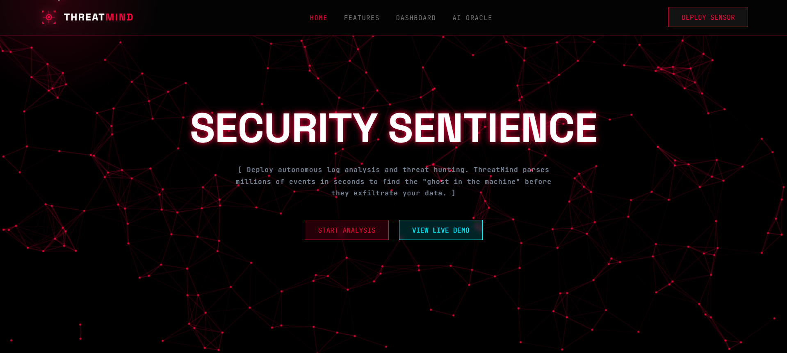

# CyberSecurity-SaaS-Platform

## THREATMIND - AI POWERED CYBERSECURITY SAAS PLATFORM

ThreatMind is a cybersecurity SaaS platform that combines Data Science, Machine Learning, Threat Intelligence, and Generative AI to automate security log analysis.
Users can upload system, firewall, or application logs and ThreatMind instantly:
- Extracts and summarizes key events<br>
- Detects anomalies using ML models<br>
- Performs threat intelligence on suspicious IPs/domains<br>
- Provides explanations and remediation advice through an AI security assistant<br>

## Live Demo: (https://threatmind.vercel.app/)

The platform simplifies complex cybersecurity workflows and empowers even non-experts to understand system threats using an intuitive dashboard and chatbot interface.




## Project Structure

```
ThreatMind/
├── start.py             #  Local development startup script
├── app/                 #  Main application directory
│   ├── main.py          #  FastAPI application & routes
│   ├── api/             #  API endpoints
│   │   ├── logs.py      #  Log upload & retrieval
│   │   └── incidents.py #  Incident management
│   ├── models/          #  Data models
│   │   ├── model.py     #  SQLAlchemy database models
│   │   └── event.py     #  Pydantic event schemas
│   ├── detection/       #  ML & rule-based detection
│   │   └── rules.py     #  Anomaly detection engine
│   ├── ingestion/       #  Log parsing & processing
│   │   ├── parser.py    #  Multi-format log parser
│   │   └── normalizer.py#  Data normalization
│   ├── services/        #  Business logic services
│   ├── storage/         #  Database configuration
│   │   └── database.py  #  SQLAlchemy setup
│   └── frontend/        #  Static web files
│       └── index.html   #  Dashboard UI
├── vercel.json          #  Vercel serverless deployment config
├── requirements.txt     #  Python dependencies
└── README.md            #  This file
```

## Quick Start

### Local Development Setup:

1. **Install Dependencies:**
   ```bash
   pip install -r requirements.txt
   ```

2. **Set up PostgreSQL Database:**
   - Make sure PostgreSQL is running locally
   - Create database: `ThreatMind`
   - Update connection string in `app/storage/database.py` if needed

3. **Run the Application:**
   ```bash
   uvicorn app.main:app --reload
   ```

4. **Access the Application:**
   - **API**: http://127.0.0.1:8000
   - **Dashboard**: http://127.0.0.1:8000/dashboard
   - **Health Check**: http://127.0.0.1:8000

### Railway Deployment

Deploying to Railway is straightforward:

1. **Install Railway CLI** (optional, you can use the Web UI):
   ```bash
   npm install -g railway
   railway login
   ```

2. **Initialize project** in repository root:
   ```bash
   railway init
   # Select "Python" when prompted
   ```

3. **Set environment variable** for Postgres (Railway can provision one automatically):
   ```bash
   railway add plugin postgresql
   ```
   or via the web dashboard, copy the generated `DATABASE_URL`.

4. **Create a Procfile** (Railway reads this for the start command):
   ```text
   web: uvicorn app.main:app --host 0.0.0.0 --port $PORT
   ```

5. **Push code** to your Git remote and connect the repo to Railway. Each push triggers a deployment.

6. **Optional:** Run migrations or seed data using `railway run`:
   ```bash
   railway run python -c "from app.storage.database import Base, engine; Base.metadata.create_all(bind=engine)"
   ```

7. **Open your deployed app** via the Railway URL - (https://cybersecurity-saas-platform-production.up.railway.app/)

Railway handles logging, environment variables, and the database for you. Enjoy!

### Features:
- Upload log files (.log, .txt, .csv)
- Real-time threat analysis and anomaly detection
- Interactive dashboard with charts and metrics
- AI-powered security assistant chat
- Threat intelligence correlation
